#Mecanum Buggy - Run Andechser 1

---
## Table of Contents

- [Motivation](#motivation)
- [Operate SG90 with wire](#operate-sg90-with-wire)
- [Operate SG90 over WiFi](#operate-sg90-servo-motor-over-wifi)
- [Build chassis](#build-chassis)
- [Search neutral pulse width](#search-neutral-pulse-width)
- [Let Buggy roll forward](#let-buggy-roll-forward)
- [Let Buggy roll sideward](#let-buggy-roll-sideward)


---
## Motivation

The beginning was a video on this NVIDIA [web page](https://blogs.nvidia.com/blog/fraunhofer-research-robotics/) (at around 0:38). 

This web page was about NVIDIA Omniverse, and how one can use Omniverse to simulate a hardware to accelerate the development of autonomous driving cart. But what caught my eyes in the video was the [Mecanum wheel](https://en.wikipedia.org/wiki/Mecanum_wheel). Mecanum wheels enable a vehicle to run sideway straight, while looking exactly to front. 

This makes staring irrelevant for a vehicle. One can remove the staring mechanism as a whole. One can also forget about turning radius of a vehicle. A corridor in a warehouse has to be only as wide as the width of the vehicle. 

I first thought how cool Fraunhofer Institute is, but it turns out Mecanum wheel was invented by a Swedish engineer Bengt Erland Ilon, and was patented in US in 1970s ('Mecanum' is the name of his company). 

I wanted to reproduce a buggy with Mecanum wheels, and would like to see if it really runs sideway with my own eyes. I will use ESP32 to operate the buggy over WiFi. 

---
## Operate SG90 with wire

### What we need

- ESP32 Wroom
- SG90 servo motor
- 18650 Li-ion battery with shield
- bread board
- wires and pins

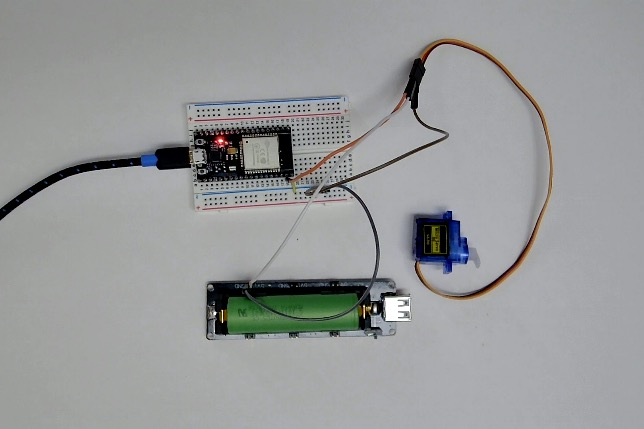

---
### Wiring

| SG90 (servo motor)  |  ESP32  |
|---------------------|---------|
| brown               | GND     |
| red                 | 5V of Li-ion 18650|
| orange              | GPIO 23 |

Make sure to **connect** GND of ESP32 and GND of Li-ion battery.

---
### Code

... is written by my Charlie (=ChatGPT).

```cpp

#include <ESP32Servo.h>

Servo servo;

const int SERVO_PIN = 23;          // signal line to Servo. GPIO
// the with of the pulse. the pulse with is between 500 us and 2400 us for many models. 
const int MIN_US = 500;            // min pulse width in micro sec.
const int MAX_US = 2400;           // max pulse width in micro sec. 

void setup() {
  Serial.begin(115200);
  delay(300);
  Serial.println("Start");
  // initialize ESP32 PWM timer. the clock is usually 50Hz.
  // esp32 servo does this internally automatically, but we will
  // explicitly do it ourselves. 

  servo.setPeriodHertz(50);
  int ok = servo.attach(SERVO_PIN, MIN_US, MAX_US);
  Serial.printf("attach=%d auf GPIO %d\n", ok, SERVO_PIN);

  servo.write(90);
  delay(1000);
}

void loop() {
  // move the arm from 0 deg to 180 deg.
  for (int angle = 0; angle <= 180; angle++) {
    servo.write(angle);
    Serial.print(angle);
    delay(10); // wait 10 ms.
  }
  // move the arm from 180 deg to 0 deg.
  for (int angle = 180; angle >= 0; angle--) {
    servo.write(angle);
    Serial.print(angle);
    delay(10);
  }
}

```

Choose the right board and the right port to upload the code. In my environment they are  following. 

|        |                        |   
|--------|------------------------|
| board  |ESP32 Dev Module        | 
| port   | /dev/cu.SLAB_USBtoUART | 


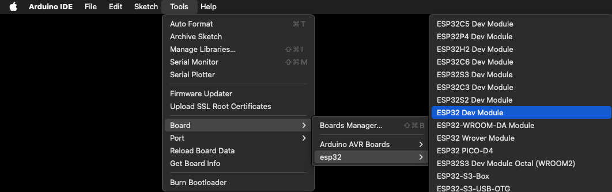

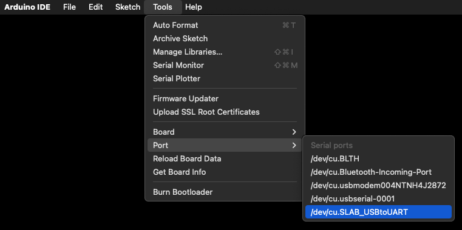

Then, check if the code compiles. 

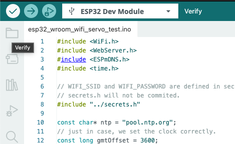

Then upload it. 

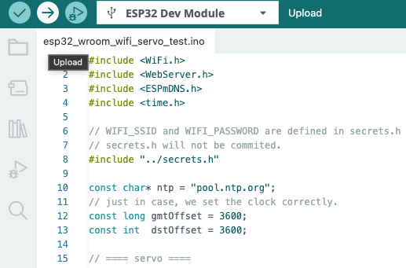

**NOTE!**

There are two types of USB micro-B cables (the interface to ESP32 from the laptop). One transmits data and power, and the other only power. The latter cannot be used to write  Arduino program on to ESP32 chip. Two cables look exactly the same. Use the one that is "known" to be a data cable. Otherwise one can easily [waste a day](https://github.com/megnergit/AWS_IoT_ESP32_E2).


After uploading the code, if SG90 motor started to wave its arm to 180 deg and then back to 0 deg, and repeat the move forever, the system is working fine. 

---
## Operate SG90 servo motor over WiFi

### Code

The wiring is the same.  Note,

1. Authentication information is stored in ```secrets.h```.
2. Please edit your ```secrets_example.h``` so that it matches your Wi-Fi settings.

The directory structure is so far as follows. 

```sh
$ tree . -L 2
.
├── esp32_wroom_wifi_servo_test
│   └── esp32_wroom_wifi_servo_test.ino
├── esp32_wroom_wired_servo_test
│   └── esp32_wroom_wired_servo_test.ino
├── images
│   ├── compile-1.png
│   ├── esp32-board-1.png
│   ├── esp32-port-1.png
│   ├── li-ion-battery-1.jpg
│   ├── Photo on 11.11.25 at 7.14 PM.jpg
│   ├── sg90-1.jpg
│   ├── upload-1.png
│   └── wiring-1.jpg
├── LICENSE
├── MECANUM
├── README.md
├── secrets_example.h
└── secrets.h

4 directories, 15 files
```

Charlie wrote the code for me. I included NTP, but it is a matter of taste. 

```cpp
 deg
#include <WiFi.h>
#include <WebServer.h>
#include <ESPmDNS.h>
#include <time.h>

// WIFI_SSID and WIFI_PASSWORD are defined in secrets.h
// secrets.h will not be commited. 
#include "../secrets.h" 

const char* ntp = "pool.ntp.org";
// just in case, we set the clock correctly.
const long gmtOffset = 3600;
const int  dstOffset = 3600;

// ==== servo ====
const int SERVO_PIN = 23;
const int LEDC_HZ   = 50;
const int LEDC_BITS = 16;
const uint32_t TOP  = (1UL << LEDC_BITS) - 1;
const uint32_t PERIOD_US = 20000;

// ---- pulse range translates to which direction the motor should rotate and how fast. 
const uint16_t SERVO_MIN_US = 500;          // min pulse width in micro second
const uint16_t SERVO_MAX_US = 2500;         // max pulse width in micro second

// This is the server that runs inside ESP32
WebServer server(80);

uint32_t usToDuty(uint16_t us){
  return (uint32_t)((uint64_t)us * TOP / PERIOD_US);
}

uint16_t angleToUs(int angle) {
  angle = constrain(angle, 0, 180);
  return SERVO_MIN_US +
         (uint16_t)((SERVO_MAX_US - SERVO_MIN_US) * (angle / 180.0));
}
// ==== LEDC has two verwions, ver. 2 and 3. 
// here we use the functions available only in ver. 3
#define LEDC_ATTACH(pin,freq,bits)  ledcAttach((pin),(freq),(bits))
#define LEDC_WRITE(pin,duty)        ledcWrite((pin),(duty))

// ---- UI ----
const char PAGE[] PROGMEM = R"HTML(
<!doctype html><meta name=viewport content="width=device-width,initial-scale=1">
<title>ESP32 Servo</title>
<style>body{font-family:sans-serif;margin:24px}.v{font-weight:700}</style>
<h1>ESP32 Servo</h1>
<p>Angle: <span class=v id=v>90</span> deg</p>
<input id=s type=range min=0 max=180 value=90
 oninput="v.textContent=this.value;fetch('/set?angle='+this.value).catch(()=>{})">
)HTML";

void handleRoot(){ server.send_P(200,"text/html",PAGE); }
void handleSet(){
  if(!server.hasArg("angle")){ server.send(400,"text/plain","missing angle"); return; }
  int angle = constrain(server.arg("angle").toInt(),0,180);
  uint16_t us = angleToUs(angle);
  LEDC_WRITE(SERVO_PIN, usToDuty(us));
  server.send(200,"text/plain",String(angle));
}

void setup(){
  Serial.begin(115200);
  // initialize LEDC (ver. 3)
  LEDC_ATTACH(SERVO_PIN, LEDC_HZ, LEDC_BITS);
  LEDC_WRITE(SERVO_PIN, usToDuty(angleToUs(90))); // this should be the neutral position. arm should not move with this pulse. 

  WiFi.mode(WIFI_STA);
  WiFi.begin(WIFI_SSID, WIFI_PASSWORD);
  Serial.print("Connecting");
  while(WiFi.status()!=WL_CONNECTED){ delay(500); Serial.print("."); }
  Serial.printf("\nIP: %s\n", WiFi.localIP().toString().c_str());\
  Serial.println(WiFi.BSSIDstr());
  Serial.println(WiFi.channel());

  WiFi.setSleep(false);

  server.on("/", handleRoot);
  server.on("/set", handleSet);
  server.begin();
  Serial.println("HTTP server started");


  // NTP
  configTime(gmtOffset, dstOffset, ntp);
  // if we want to make UTC to CET or CEST
  setenv("TZ", "CET-1CEST,M3.5.0/2,M10.5.0/3", 1); tzset();

  // synchronize the clock.
  struct tm t;
  for (int i=0;i<10 && !getLocalTime(&t); ++i) { delay(500); }
  if (getLocalTime(&t)) {
    char buf[32];
    strftime(buf,sizeof(buf),"%F %T",&t);
    Serial.printf("Time synced: %s\n", buf);
  } else {
    Serial.println("Time sync failed (yet).");
  }

}

void loop(){ server.handleClient(); }

```

Upload the code as before. Open serial monitor by clicking here. 

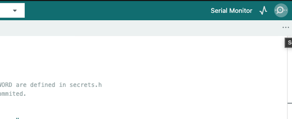

Then you will see something like this. 

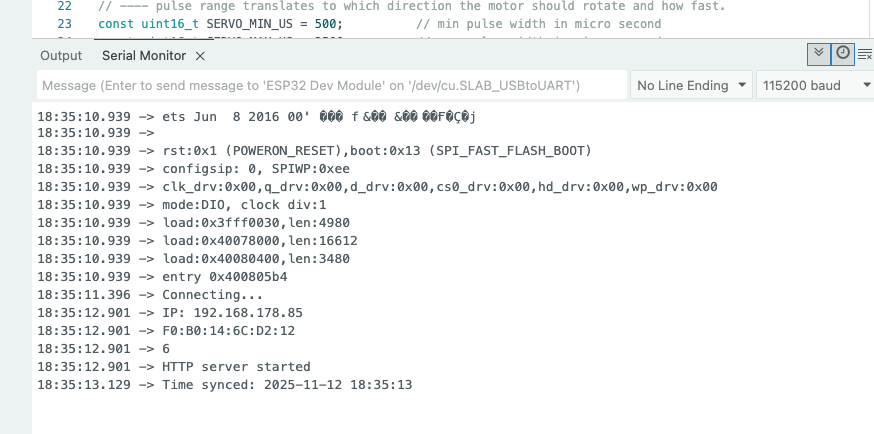

Open the IP ```192.168.178.85``` in this case, as you see in the serial monitor (yours will be different). 

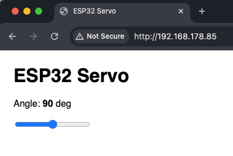

Move the slider, and see the arm of SG90 servo motor rotates accordingly. 

**NOTE!**

When you encounter that 'No Route or Path found' error, check, 'Local Network' in system preference in the case of Mac OSX. Make sure that Arduino IDE and your browser (here Google Chrome) are allowed to access the local network (= your home network). 


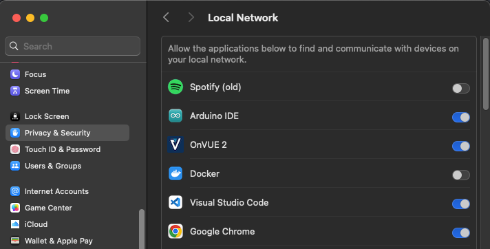


---
## Build Chassis

### Remove caps of potentiometers 

It turns out SG90 rotates only +-180 degrees, which means the car moves only 2-3 mm. 
In order to let the motor rotate continuously, over 360 degrees, we would need [FS90](https://eckstein-shop.de/Feetech-FS90-6V-15kgcm-Analog-Servo). 

It costs, and takes time to get them. 

So I decided to break the potentiometers inside SG90. 


The green device at the left of the motor is the potentiometer. One can just rip off the black cap to let the motor rotate continuously. The 4 black caps on the right are the ones that are already removed from other motors. 

**Note!** **This is an irreversible process.** One cannot put the cap back again on the potentiometer. Please do this with an SG90 motor that you are allowed to break.

### File horn of motors

The wheels I bought have a hub like a circular, boxy hole to fix the motor. The horns of SG90 do not fit. So I had to file the horns a bit. 

Put plastic adhesive inside the wheel holes, push the motor horns into the hubs, and wait over a night.  

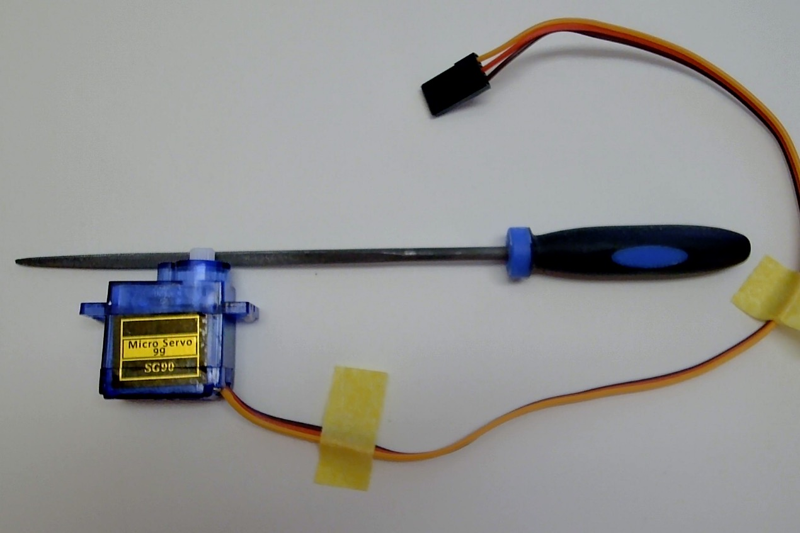

### Build Chassis

... with a cream cheese container. 
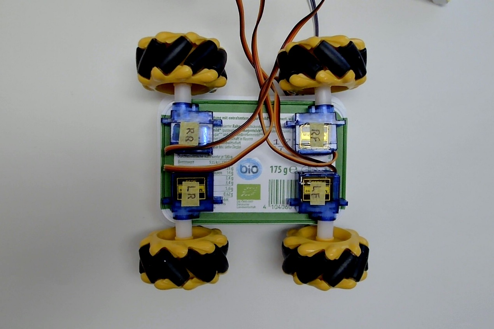

**Note that this is a bottom view**. That is why the labeling are flipped left and right. Also note the direction of the tilting of the sub-wheels (installed on a main wheel with +-45 degrees rotation). They should look "<>" from the bottom, and "><" from the top. 

The name of our prototype vehicle is "Andechser 1". 
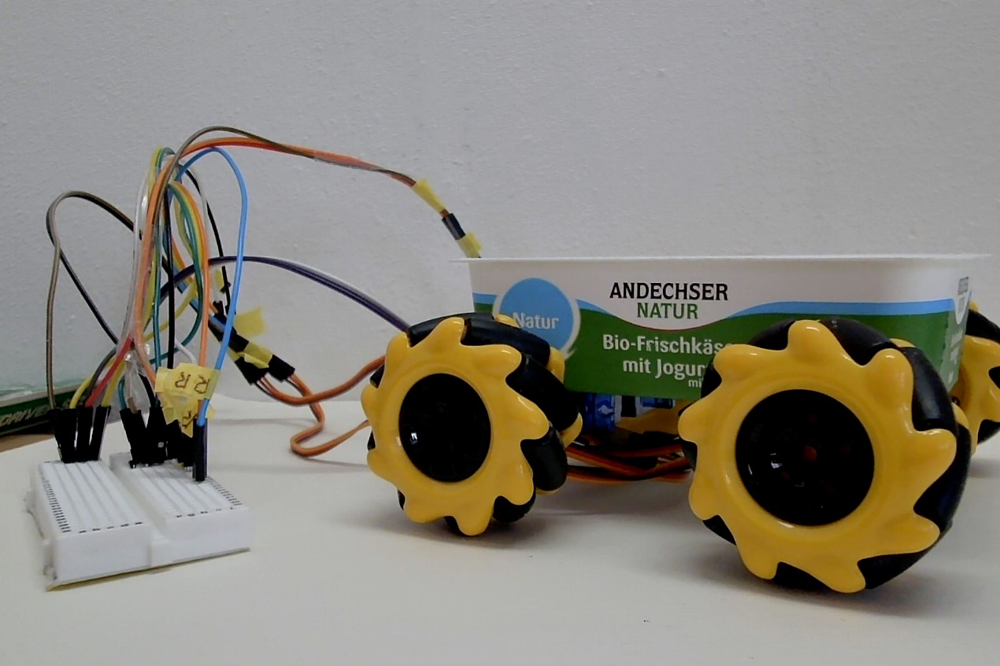

---
## Search neutral pulse width

Our goal here is to let Andechser 1 to **run forward straight**. 

This is not a trivial mission, as we do not have potentiometers any more, we cannot use the absolute position of the rotation angle of the motors. We will control an SG90 motor solely by the pulse widths. 

A pulse width is a duration of a pulse (I imagine, it is a width of a top-hat signal) we give to the control pin of the motor (orange cable). The minimum and the maximum pulse widths are around 500 micro-sec and 2500 micro-sec.  

At around 1100--1200 micro-secs pulse, the motor stops rotating, and stands still. If the pulse width is shorter than that, the motor rotates to one direction. If the pulse width is a lot shorter than that, the motor rotates to the same direction but faster. When the pulse width is longer than the neutral pulse width, the motor rotates to the other direction. 

The problem is that we do not know what is the neutral pulse width for a given SG90 motor. Therefore we have to find out by changing the pulse width and see if the wheel stops rotating. 

`// filename: esp32_wroom_auto_test.inu
```cpp
#include <Arduino.h>

// ===== PWM/LEDC basic =====
const int LEDC_HZ   = 50;
const int LEDC_BITS = 16;
const uint32_t TOP  = (1UL << LEDC_BITS) - 1;
const uint32_t PERIOD_US = 20000;

// ===== test target: one wheel (RF) =====
const int PIN_LF = 23;
const int PIN_RF = 22;
const int PIN_LR = 19;
const int PIN_RR = 18;

// ===== control in microseconds =====
// Here are the default neutral pulse width

// int NEUTRAL_US = 1270;  // halt LF
// int NEUTRAL_US = 1273;  // halt RF
int NEUTRAL_US = 1179;  // halt LR
// int NEUTRAL_US = 1175;  // halt RR

const int PIN_TEST = PIN_LR;

int DELTA_US   = 30;  // defaulf offset.

// ===== helpers =====
uint32_t usToDuty(uint16_t us){
  return (uint32_t)((uint64_t)us * TOP / PERIOD_US);
}
void writeUs(int pin, int us){
  us = constrain(us, 500, 2500);
  ledcWrite(pin, usToDuty(us));
}
void stopRF(){ writeUs(PIN_TEST, NEUTRAL_US); }
void fwdRF(){  writeUs(PIN_TEST, NEUTRAL_US + DELTA_US); }

void printStatus(const char* tag){
  Serial.print(tag);
  Serial.print("  NEUTRAL_US="); Serial.print(NEUTRAL_US);
  Serial.print("  DELTA_US=");   Serial.print(DELTA_US);
  Serial.print("  (stop=");      Serial.print(NEUTRAL_US);
  Serial.print(", fwd=");        Serial.print(NEUTRAL_US + DELTA_US);
  Serial.println(")");
}

void setup(){
  Serial.begin(115200);
  Serial.println("\n=== One-wheel test (RF@GPIO22) ===");
  Serial.println("Keys: s=Stop, f=Forward, [ / ] = Neutral -/+1us, < / > = Delta -/+1us, p=print");

  ledcAttach(PIN_TEST, LEDC_HZ, LEDC_BITS);
  stopRF();  // at the start, use neutral pulse width given above.
  printStatus("INIT");
}

void loop(){
  // wait for the input through serial monitor
  if(Serial.available()){
    char c = Serial.read();
    if(c=='s'){ stopRF();  printStatus("STOP"); }
    if(c=='f'){ fwdRF();   printStatus("FWD "); }
    if(c=='['){ NEUTRAL_US--; stopRF(); printStatus("NEUT-"); }
    if(c==']'){ NEUTRAL_US++; stopRF(); printStatus("NEUT+"); }
    if(c=='<'){ if(DELTA_US>0) DELTA_US--; printStatus("DLTA-"); }
    if(c=='>'){ DELTA_US++; printStatus("DLTA+"); }
    if(c=='p'){ printStatus("STAT"); }
  }

  // do nothing. 
  delay(5);
}

```

The procedure is, 

1. select the wheel to test. 

```cpp
const int PIN_TEST = PIN_LR;
```

In this case we will look for the neutral pulse width of the left rear wheel. 

2. just after we upload the code, the left rear wheel is most likely rotating. 

3. open serial monitor, click on the input window to activate the keyboard input, and then hit '[' or ']'. This reduces or increases the pulse width.

4. look for the pulse width where the motor stops rotating, and note it. 

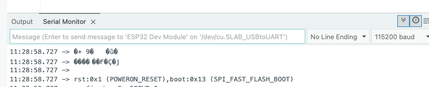

---
## Let Buggy roll forward

In order a buggy to roll forward, following two conditions must be met.

1. All four wheels rotates to the same direction. 
2. All four wheels rotates about the same speed. 

### Wiring

There are no real constraints but the code assumes

| Wheel |  ESP32  |
|-------|---------|
| LF    | GPIO 23 |
| RF    | GPIO 22 |
| LR    | GPIO 19 |
| RR    | GPIO 18 |

Other points are

- use Li-ion 18650 battery to feed the power to the motors (do not take 5V from ESP32).
- **Do not feed 5V to ESP32**. ESP32 drives with 3.3 V.
- connect GND of 18650 and ESP32. 


As you see, LF is too fast, and RF is too slow. Need more adjustment. 

User interface. 
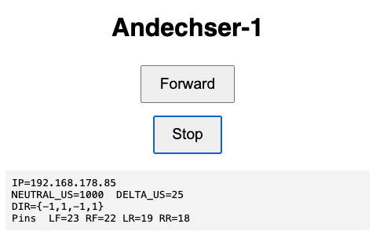

---
## Let Buggy roll sideward


Satisfied. Herr Ilon was correct. 

User interface. 
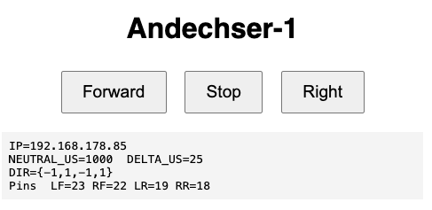

The code is in the directory ```esp32_wroom_auto_sideward```.

---
## Memorandum

### How to create gif animation from mov file

1. take a movie clip with QuickTime Player and a web cam.
2. convert it to gif file,
```sh
ffmpeg -i input.mov -filter_complex "[0:v] fps=30,scale=640:-1:flags=lanczos,split [a][b];[a] palettegen [p];[b][p] paletteuse" output.gif
``` 
---
### How to create gif animation from MP4 file

1. take a movie with a compact digital camera
2. convert it to gif file, 
```sh

ffmpeg -i input.mp4 -filter_complex \
"[0:v] fps=30,scale=640:-1:flags=lanczos,split [a][b];\
[a] palettegen [p];[b][p] paletteuse" \
output.gif
```

---
# END
---

